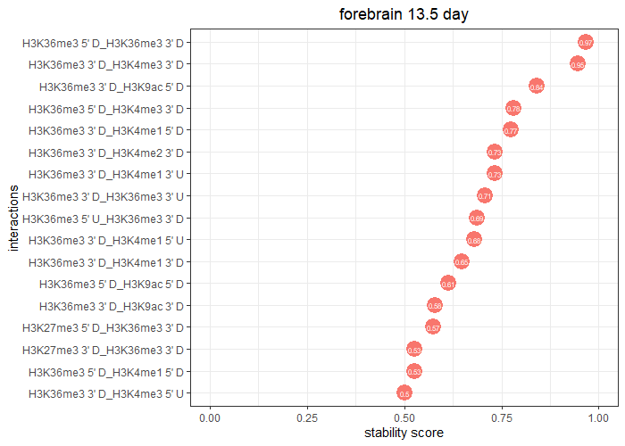

# Analysis pipelines

## Data preprocessing
### Step 1: Data download
Data is downloaded from encode database (https://www.encodeproject.org/). 
We selected mouse embryonic tissue developmental data from forebrain, hindbrain, midbrain, neural tube, heart, liver and limb from 6 time points 
(E11.5 - E16.5 day). 
The detail datasets we used are at data/encode_data_table.

The datasets used in this manuscript can be downloaded using the following R script:

```R
Rscript ./data/download.sample.R
```

### Step 2: Run rMATs (http://rnaseq-mats.sourceforge.net/) to detect alternative splicing events
For each sample, we used rMATs to detect potential alternative spliced exons. 
All the jobs were ran on PMACS sever at University of Pennsylvania using customized scripts.
Example of rMATs command: 

```R
RNASeq-MATS.py -b1 input_bam_timepoint_1_rep1,input_bam_timepoint_1_rep2 -b2 input_bam_timepoint_2_rep1,input_bam_timepoint_2_rep2 
-gtf gencode.vM4.annotation.gtf -t single -len 100 -c 0.0001 -analysis U -novelSS 1 -keepTemp -o rMATs.out
```
### Step 3: Identify splicing categories from rMATs output
Example usage for individual sample:

```R
library(HMSplicing)
rmats.result <- read.table("./example_data/forebrain.12.5.vs.11.5.rmast.out", sep="\t", header=T)
rmatsClassified <- classify_splicing_code(rmats.result)
head(rmatsClassified)
```
```
      ID                GeneID geneSymbol  chr strand exonStart_0base   exonEnd upstreamES upstreamEE downstreamES
6  16886 ENSMUSG00000040797.12     Iqsec3 chr6      -       121378959 121379909  121372932  121376531    121379994
10 11233 ENSMUSG00000038671.11     Arfrp1 chr2      -       181361000 181361066  181357832  181359561    181361390
12 11235 ENSMUSG00000038671.11     Arfrp1 chr2      -       181361000 181361069  181359314  181359561    181361390
13 12590  ENSMUSG00000059974.6        Ntm chr9      -        29006253  29006289   29000704   29000737     29009225
15 16697  ENSMUSG00000037211.8      Spry1 chr3      +        37640519  37640808   37639957   37640105     37642554
16 30964  ENSMUSG00000059742.6      Kcnh7 chr2      -        62845314  62845338   62837065   62837280     62850349
   downstreamEE  ID.1 IC_SAMPLE_1 SC_SAMPLE_1 IC_SAMPLE_2 SC_SAMPLE_2 IncFormLen SkipFormLen       PValue          FDR
6     121380044 16886         4,1         0,0        5,12         8,2       1049          99 5.108369e-11 3.184898e-07
10    181361472 11233         3,1         0,0         0,0         2,3        165          99 4.071635e-10 1.523117e-06
12    181361472 11235         2,1         0,0         0,0         2,3        168          99 1.787005e-09 4.774877e-06
13     29009377 12590         1,1         0,0         3,0         6,3        135          99 1.786725e-09 4.774877e-06
15     37644598 16697        8,17       24,16         0,0       35,35        388          99 2.081150e-09 5.190110e-06
16     62850778 30964         1,1         0,0         0,0        2,12        123          99 2.467113e-09 5.768110e-06
     IncLevel1   IncLevel2 IncLevelDifference ave_inclevel class
6      1.0,1.0 0.056,0.362              0.791        0.209     0
10     1.0,1.0     0.0,0.0              1.000        0.000     0
12     1.0,1.0     0.0,0.0              1.000        0.000     0
13     1.0,1.0   0.268,0.0              0.866        0.134     0
15 0.078,0.213     0.0,0.0              0.145        0.000     0
16     1.0,1.0     0.0,0.0              1.000        0.000     0
```

### Step 4: Quantify ChIP-seq signals from exon flanking regions
There are different ways to quantify the the ChIP-seq signals, we provide a perl code to do it.
Example Usage:
$samfile: "sam file fore each sample";
$asfile: "results from rmatsClassified for each sample";
$outfile: "output file names"

```R
perl count.hm.reads.pl $samfile $asfile $outfile
```
This will generate a file similar to ./example_data/H3K4me1.canonical.exon.signal.

### Step 5: Get hPTM features for each marker in the exon flanking region and prepare for modelling
Example Usage for H3K4me1:

```R
hPTM <- read.table("./example_data/forebrain.mixed.12.5day.H3K4me1.1.bam.sam.hm.signal", sep="\t", header=TRUE)
hPTMsig <- HMflankingSig(hPTM, "H3K4me1", 22497119)
head(hPTMsig)
```
```
  class H3K4me1_chip_left_intron H3K4me1_chip_left_exon H3K4me1_chip_right_intron H3K4me1_chip_right_exon
1     0               0.17780054             0.04445014                0.40005122              0.17780054
2     0               0.08890027             0.13335041                0.04445014              0.08890027
3     0               0.04445014             0.17780054                0.04445014              0.04445014
4     0               0.13335041             0.08890027                0.08890027              0.13335041
5     0               0.26670082             0.22225068                0.26670082              0.26670082
6     0               0.13335041             0.22225068                0.22225068              0.13335041
```
Depends on how many markers are available for the study, the final results will combine multiple hPTMsig files together,
so that each gene will have hPTM features from all markers.


## Data exploration and basic modelling

### Plot distributions of hPTMs in the exon flanking region

Below is an example that we plot the distribution of H3K4me1 in the exon flanking regions for different exon splicing patterns. 
In this example, signals from constitutive exons were not sampled.

```R
hPTM <- read.table("./example_data/forebrain.mixed.12.5day.H3K4me1.1.bam.sam.hm.signal", sep="\t", header=TRUE)
plotCoverage(hPTM, total_reads=22497119, c("forebrain", "H3K4me1", "12.5 day"), subsampleCanonical=F, CanonicalFile=NULL)
```
 

Constitutive exons can be used as a control to see if the hPTM pattern is enriched in alternative exons, so we also provide an option to sample signals from constitutive exons. 
In this case, a file contains all constitutive exons and their correspondent hPTM signals in the flanking regions is needed (example file at ./example_data/H3K4me1.canonical.exon.signal).

```R
plotCoverage(hPTM, total_reads=22497119, c("forebrain", "H3K4me1", "12.5 day"), subsampleCanonical=T, CanonicalFile="./example_data/H3K4me1.canonical.exon.signal")
```
 

### Run plain logistic and random forest model

```R
allFeatures <- read.table("forebrain.13.5day.HMfeatures.txt", sep="\t", header=TRUE)
gain.loss.features <- allFeatures[allFeatures$class==0 | allFeatures$class==1, ]
gain.loss.modelResult <- model(gain.loss.features)
str(gain.loss.modelResult)
```
It will generate the performance measurements for logistic regression and random forest model and
provide information for important markers.

```
List of 3
 $ rf.performance   :'data.frame':	6 obs. of  5 variables:
  ..$ accuracy : num [1:6] 0.64 0.66 0.714 0.66 0.698 ...
  ..$ Precision: num [1:6] 0.407 0.462 0.538 0.465 0.413 ...
  ..$ recall   : num [1:6] 0.569 0.677 0.754 0.635 0.844 ...
  ..$ f1       : num [1:6] 0.475 0.549 0.628 0.537 0.555 ...
  ..$ auc      : num [1:6] 0.693 0.707 0.747 0.723 0.735 ...
 $ logit.performance:'data.frame':	6 obs. of  5 variables:
  ..$ accuracy : num [1:6] 0.616 0.601 0.576 0.591 0.579 ...
  ..$ Precision: num [1:6] 0.1605 0.2747 0.0769 0.2907 0.1196 ...
  ..$ recall   : num [1:6] 0.565 0.625 0.778 0.532 0.733 ...
  ..$ f1       : num [1:6] 0.25 0.382 0.14 0.376 0.206 ...
  ..$ auc      : num [1:6] 0.494 0.655 0.573 0.54 0.591 ...
 $ impscore         :'data.frame':	32 obs. of  7 variables:
  ..$ variable: chr [1:32] "H3K27ac_chip_left_exon" "H3K27ac_chip_left_intron" "H3K27ac_chip_right_exon" "H3K27ac_chip_right_intron" ...
  ..$ 1       : num [1:32] 12.3 10.1 10.7 12 13 ...
  ..$ 2       : num [1:32] 13.71 8.58 9.61 13.35 14.46 ...
  ..$ 3       : num [1:32] 14 10.6 11.4 12.7 12.8 ...
  ..$ 4       : num [1:32] 14.05 8.68 8.98 12.45 14.73 ...
  ..$ 5       : num [1:32] 11.9 11.3 11.3 11.7 12.8 ...
  ..$ ave     : num [1:32] 13.2 9.86 10.4 12.45 13.55 ...
```

### Visualize important markers in each flanking region
```r
plotFeatureImp(gain.loss.modelResult$impscore, title="forebrain 13.5 day")
```


### Visulize model performance
Below is examples to visulize the model performance from our analysis.

Visulization of performance for random forest. 

plotRFperformance function will generate performance plots for every tissue stored in a list.

```r
rfPerf <- read.table("./example_data/alldata.rf.perf.gain.vs.loss.txt", sep="\t", header=TRUE)
pl.list <- plotRFperformance(rfPerf)
# show the first plot
pl.list[[1]]
```


Visulization of the performance comparison between random forest and logistic regression. 

Similarly, plotModelPerformance
will generate the barplot comparing the performance between logistic and random forest model for every tissue stored
in a list.

```r
rfPerf <- read.table("./example_data/alldata.rf.perf.gain.vs.loss.txt", sep="\t", header=TRUE)
logitPerf <- read.table("./example_data/alldata.logit.perf.gain.vs.loss.txt", sep="\t", header=TRUE)
pl.list <- plotModelPerformance(rfPerf, logitPerf)
# show the first plot
pl.list[[1]]
```


### Run iterative Random forest model to detect reliable hPTM interactions (5-fold CV)

```r
interaction.list <- iRFModel(gain.loss.features, n.iter = 20, n.interaction = 10, bootstrap = 30)
head(interaction.list)
```
```
32   H3K36me3_chip_left_exon_H3K36me3_chip_right_intron 0.9666667
78 H3K36me3_chip_right_intron_H3K4me3_chip_right_intron 0.9466667
79     H3K36me3_chip_right_intron_H3K9ac_chip_left_exon 0.8400000
42    H3K36me3_chip_left_exon_H3K4me3_chip_right_intron 0.7800000
67    H3K36me3_chip_right_intron_H3K4me1_chip_left_exon 0.7733333
74 H3K36me3_chip_right_intron_H3K4me2_chip_right_intron 0.7333333
```

Visulization top interactions
```r
plotInteraction(interaction.list, cutoff=0.5, "forebrain", "13.5 day")
```



 