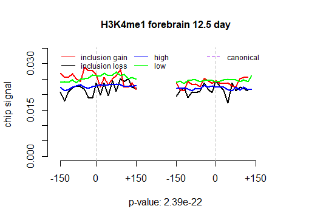
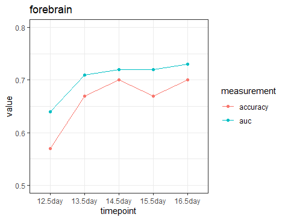

## Data exploration and basic modelling

### Plot distributions of hPTMs in the exon flanking region

Below is an example that we plot the distribution of H3K4me1 in the exon flanking regions
for different exon splicing patterns. In this example, signals from constitutive exons were not sampled.

```R
hPTM <- read.table("./example_data/forebrain.mixed.12.5day.H3K4me1.1.bam.sam.hm.signal", sep="\t", header=TRUE)
plotCoverage(hPTM, total_reads=22497119, c("forebrain", "H3K4me1", "12.5 day"), subsampleCanonical=F, CanonicalFile=NULL)
```
 

Constitutive exons can be used as a control to see if the hPTM pattern is enriched in alternative exons, 
so we also provide an option to sample signals from constitutive exons. 
In this case, a file contains all constitutive exons and their correspondent hPTM signals 
in the flanking regions is needed (example file at ./example_data/H3K4me1.canonical.exon.signal).

```R
plotCoverage(hPTM, total_reads=22497119, c("forebrain", "H3K4me1", "12.5 day"), subsampleCanonical=T, CanonicalFile="./example_data/H3K4me1.canonical.exon.signal")
```
 

### Run plain logistic and random forest model

```R
allFeatures <- read.table("forebrain.13.5day.HMfeatures.txt", sep="\t", header=TRUE)
gain.loss.features <- allFeatures[allFeatures$class==0 | allFeatures$class==1, ]
gain.loss.modelResult <- model(gain.loss.features)
str(gain.loss.modelResult)
```
It will generate the performance measurements for logistic regression and random forest model and
provide information for important markers.

```
List of 3
 $ rf.performance   :'data.frame':	6 obs. of  5 variables:
  ..$ accuracy : num [1:6] 0.64 0.66 0.714 0.66 0.698 ...
  ..$ Precision: num [1:6] 0.407 0.462 0.538 0.465 0.413 ...
  ..$ recall   : num [1:6] 0.569 0.677 0.754 0.635 0.844 ...
  ..$ f1       : num [1:6] 0.475 0.549 0.628 0.537 0.555 ...
  ..$ auc      : num [1:6] 0.693 0.707 0.747 0.723 0.735 ...
 $ logit.performance:'data.frame':	6 obs. of  5 variables:
  ..$ accuracy : num [1:6] 0.616 0.601 0.576 0.591 0.579 ...
  ..$ Precision: num [1:6] 0.1605 0.2747 0.0769 0.2907 0.1196 ...
  ..$ recall   : num [1:6] 0.565 0.625 0.778 0.532 0.733 ...
  ..$ f1       : num [1:6] 0.25 0.382 0.14 0.376 0.206 ...
  ..$ auc      : num [1:6] 0.494 0.655 0.573 0.54 0.591 ...
 $ impscore         :'data.frame':	32 obs. of  7 variables:
  ..$ variable: chr [1:32] "H3K27ac_chip_left_exon" "H3K27ac_chip_left_intron" "H3K27ac_chip_right_exon" "H3K27ac_chip_right_intron" ...
  ..$ 1       : num [1:32] 12.3 10.1 10.7 12 13 ...
  ..$ 2       : num [1:32] 13.71 8.58 9.61 13.35 14.46 ...
  ..$ 3       : num [1:32] 14 10.6 11.4 12.7 12.8 ...
  ..$ 4       : num [1:32] 14.05 8.68 8.98 12.45 14.73 ...
  ..$ 5       : num [1:32] 11.9 11.3 11.3 11.7 12.8 ...
  ..$ ave     : num [1:32] 13.2 9.86 10.4 12.45 13.55 ...
```

### Visualize important markers in each flanking region
```r
plotFeatureImp(gain.loss.modelResult$impscore, title="forebrain 13.5 day")
```


### Visulize model performance
Below is examples to visulize the model performance from our analysis.

Visulization of performance for random forest. 

plotRFperformance function will generate performance plots for
every tissue stored in a list.

```r
rfPerf <- read.table("./example_data/alldata.rf.perf.gain.vs.loss.txt", sep="\t", header=TRUE)
pl.list <- plotRFperformance(rfPerf)
# show the first plot
pl.list[[1]]
```


Visulization of the performance comparison between random forest and logistic regression. 

Similarly, plotModelPerformance
will generate the barplot comparing the performance between logistic and random forest model for every tissue stored
in a list.

```r
rfPerf <- read.table("./example_data/alldata.rf.perf.gain.vs.loss.txt", sep="\t", header=TRUE)
logitPerf <- read.table("./example_data/alldata.logit.perf.gain.vs.loss.txt", sep="\t", header=TRUE)
pl.list <- plotModelPerformance(rfPerf, logitPerf)
# show the first plot
pl.list[[1]]
```


### Run iterative Random forest model to detect reliable hPTM interactions (5-fold CV)

```r
interaction.list <- iRFModel(gain.loss.features, n.iter = 20, n.interaction = 10, bootstrap = 30)
head(interaction.list)
```
```
32   H3K36me3_chip_left_exon_H3K36me3_chip_right_intron 0.9666667
78 H3K36me3_chip_right_intron_H3K4me3_chip_right_intron 0.9466667
79     H3K36me3_chip_right_intron_H3K9ac_chip_left_exon 0.8400000
42    H3K36me3_chip_left_exon_H3K4me3_chip_right_intron 0.7800000
67    H3K36me3_chip_right_intron_H3K4me1_chip_left_exon 0.7733333
74 H3K36me3_chip_right_intron_H3K4me2_chip_right_intron 0.7333333
```

Visulization top interactions
```r
plotInteraction(interaction.list, cutoff=0.5, "forebrain", "13.5 day")
```


 